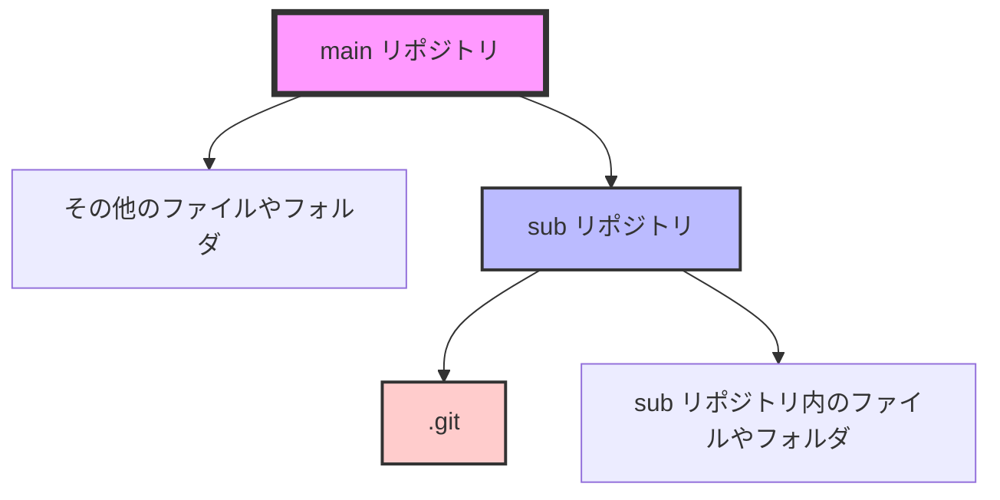

## はじめに
:::message
本記事の執筆者：Claude 3.5 Sonnetさん
本記事の編集者：Meg

素のMegの記事が読みたい方はこちら！→[Meg Log](https://biotech-univ.com/)
:::


Gitで管理しているリポジトリ内に、別のGitリポジトリを配置しようとしたら、予想外の警告メッセージが。 

今回は、この問題の原因と対処法について、自分なりに調べてみたことを共有。

## 問題の状況

まず、どんな状況だったのか説明します。

1. `main`というGitリポジトリが存在（普通に管理してるやつ。リモートリポジトリあり）
2. `sub`という別のGitリポジトリが存在（これまでローカルだけで管理してた。リモートリポジトリ無し）
3. `sub`を`main`の中に配置しようと作業
4. commitしようとしたら、警告メッセージが！

## 警告メッセージの内容

警告メッセージはこんな感じでした：

```
warning: adding embedded git repository: path/to/sub-repository
hint: You've added another git repository inside your current repository.
hint: Clones of the outer repository will not contain the contents of
hint: the embedded repository and will not know how to obtain it.
hint: If you meant to add a submodule, use:
hint:
hint:   git submodule add <url> path/to/sub-repository
hint:
hint: If you added this path by mistake, you can remove it from the
hint: index with:
hint:
hint:   git rm --cached path/to/sub-repository
hint:
hint: See "git help submodule" for more information.
```
要するに「リポジトリの中にリポジトリを入れようとしてるよ？それって大丈夫？」って感じですね。

## 問題の原因

この警告が出る原因は、実はシンプルです。

Gitは通常、1つのリポジトリの中に別のリポジトリを「入れ子」にすることを想定していません。だから、そんなことをしようとすると「ちょっと待って！」って言ってくるわけです。

図で表すとこんな感じ。



`main repository`の中に`.git`ディレクトリを持つ`sub repository`があるのが問題なんです。

## 対処法

じゃあ、どうすればいいの？という話ですが、いくつか方法があります。

1. サブモジュールとして追加する
2. 内部リポジトリの`.git`ディレクトリを削除する
3. 内部リポジトリの内容をメインリポジトリにマージする

今回はエラーメッセージのヒントにも似たようなのがある、2番目の方法を採用。やり方はこんな感じ。

1. まず、内部リポジトリの`.git`ディレクトリを削除します：

   ```bash
   rm -rf trunk/SRC/NT24_I3_Src_EC2/.git
   ```

2. 次に、変更をステージングエリアに追加します。

   ```bash
   git add trunk/SRC/NT24_I3_Src_EC2
   ```

3. そして、変更をコミットします：

   ```bash
   git commit -m "Add sub repository to main repository"
   ```

これで、警告なしにコミットできるはずです！

## 注意点

ただし、この方法だと内部リポジトリのGit履歴が失われちゃいます。もし履歴を残しておきたい場合は、別の方法を考えないといけません。

## まとめ

今回は、Gitリポジトリの中に別のGitリポジトリを配置しようとしたときに起こる問題とその対処法について説明しました。

みなさんも似たような経験があれば、コメントで教えてください！
